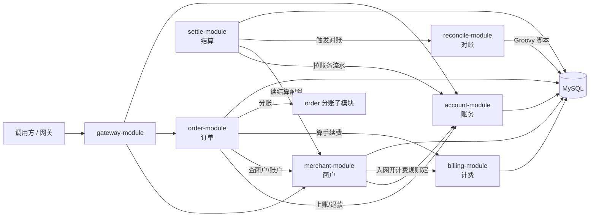

# pay-management

一套面向 **支付 / 清结算** 场景的 Java 微服务练习项目。你可以把它理解成一家「支付公司」的后台系统：商户在这里入驻，用户在这里下单支付，钱记在账户里，手续费单独算，最后按周期结算，还能和渠道对账。

项目采用 **Spring Boot + Spring Cloud** 拆分多个服务，通过 **Nacos** 做服务发现，通过 **OpenFeign** 做服务间调用。

---

## 一图看懂整体架构



**一句话流程：**

> 商户入驻 → 下单支付 → 账务上账 → 分账/计费 → 日终对账 → 按周期出结算单

---

## 模块一览

| 模块 | 是否独立启动 | 默认端口 | 路径前缀 | 一句话说明 |
|------|:------------:|---------:|----------|------------|
| [account-module](#account-module账务模块) | ✅ | 8081 | `/account/` | 管钱：开户、上账、下账、冻结、转账 |
| [auth-module](#auth-module认证鉴权模块) | ✅ | 8088 | `/auth/` | 认证鉴权：登录、JWT 签发、权限控制 |
| [merchant-module](#merchant-module商户模块) | ✅ | 8082 | `/merchant/` | 管商户：入驻、绑账户、费率、结算配置 |
| [order-module](#order-module订单模块) | ✅ | 8083 | `/order/` | 管交易：下单、支付、退款、分账 |
| [gateway-module](#gateway-module网关模块) | ✅ | 8084 | `/gateway/` | 统一入口，路由到各后端服务 |
| [settle-module](#settle-module结算模块) | ✅ | 8085 | — | 按周期从账务抽数，生成结算单 |
| [billing-module](#billing-module计费模块) | ✅ | 8086 | `/billing/` | 手续费规则与计算，支持梯度计费 |
| [reconcile-module](#reconcile-module对账模块) | ✅ | 8087 | `/reconcile/` | Groovy 脚本对账，脚本存数据库 |
| [common-module](#common-module公共模块) | ❌ | — | — | 公共工具、异常、枚举等 |
| [fegin-module](#fegin-modulefeign-模块) | ❌ | — | — | 各服务之间的 Feign 接口定义 |

---

## 各模块详细介绍

### account-module（账务模块）

**它是干什么的？**

账务模块就像银行的「账本系统」。所有和钱相关的操作都经过这里，保证 **钱不会凭空多出来，也不会悄悄少掉**。

**核心能力：**

- 开户、改户、查户
- 上账 / 下账（收入、支出）
- 冻结 / 解冻（风控、担保等场景）
- 转账（两个账户之间搬钱）
- 流水查询、汇总统计
- 日终账务核对（期初 + 发生额 = 期末）

**账户模型（通俗版）：**

| 字段 | 含义 |
|------|------|
| `balance` | 账面总余额 |
| `frozen_balance` | 被冻结、暂时不能用的钱 |
| 可用余额 | `balance - frozen_balance` |

**设计要点：**

- 用 **Redisson 分布式锁** 防止并发抢余额
- 余额变更走 **单条 SQL 原子更新**，避免「先查再改」的并发漏洞
- 冻结 ≠ 扣款，解冻后钱还在

**主要接口示例：**

- `POST /account/open/save` — 开户
- `POST /account/operation/up` — 上账
- `POST /account/operation/down` — 下账
- `POST /account/operation/transfer` — 转账
- `POST /account/admin/reconcile/daily` — 账务日核对

---

### auth-module（认证鉴权模块）

**它是干什么的？**

负责全局的用户认证与权限校验。基于 Spring Security + JWT 实现无状态登录，支持 RBAC 权限模型。

**核心能力：**

- 用户登录 / 登出
- JWT Access/Refresh Token 签发与刷新
- 基于 `@RequiresPermission` 注解的接口级权限拦截
- 默认初始化超级管理员账号（admin / admin123）

**主要接口示例：**

- `POST /auth/login` — 用户登录
- `POST /auth/logout` — 退出登录
- `POST /auth/refresh` — 刷新 Token
- `GET /auth/me` — 获取当前用户信息

---

### merchant-module（商户模块）

**它是干什么的？**

商户模块管理「谁来收钱」。一家店想接入支付，先要在这里 **入驻**，绑定资金账户，配置费率和结算方式。

**核心能力：**

- 商户增删改查
- **一键入驻**：`saveWithAccount` 同时完成「建商户 + 绑账户 + 开计费规则」
- 商户与账户绑定（现金户、待清分户等）
- 费率配置（比例 / 固定 / 混合）
- 结算周期配置（日结 / 周结 / 月结）
- 终端绑定、渠道配置、银行卡信息

**和其他模块的关系：**

- 入驻时通过 Feign 调用 **account-module** 开户
- 入驻时通过 Feign 调用 **billing-module** 自动开通默认计费规则
- **settle-module** 读取这里的结算配置，决定什么时候结算

**主要接口示例：**

- `POST /merchant/info/save` — 新建商户
- `POST /merchant/info/saveWithAccount` — 商户入驻（含开户 + 计费）
- `POST /merchant/fee/save` — 保存费率
- `GET /merchant/settle/listActive` — 查询生效中的结算配置

---

### order-module（订单模块）

**它是干什么的？**

订单模块处理「用户买了一笔东西」的完整生命周期：创建订单 → 发起支付 → 支付成功上账 → 如需则退款。

**核心能力：**

- 创建订单、查询订单、更新状态
- 支付（对接渠道）
- 退款
- 支付成功后 **MQ 异步上账**
- **分账**（`com.al.split` 子模块）：把一笔钱拆成「平台手续费 + 商户待清分净额」

**分账流程（简化）：**

1. 支付成功，账务上账完成
2. 发送分账 MQ 消息
3. 调用 **billing-module** 计算手续费
4. 按规则把手续费和净额转到对应账户

**主要接口示例：**

- `POST /order/business/create` — 创建订单
- `POST /order/business/refund` — 退款
- `POST /order/split/execute` — 执行分账
- `GET /order/split/query` — 查询分账结果

**初始化 SQL：** `order-module/src/main/resources/sql/order_split.sql`

---

### gateway-module（网关模块）

**它是干什么的？**

网关是所有外部请求的 **统一大门**。外部系统不直接访问各个微服务，而是先打到网关，由网关转发。

**特点：**

- 基于 **Spring Cloud Gateway**（响应式）
- 可配合 Nacos 做动态路由
- 可扩展鉴权、限流（项目内可接入 Sentinel 等）

**默认端口：** 8084，路径前缀 `/gateway/`

---

### settle-module（结算模块）

**它是干什么的？**

结算模块负责 **把钱算清楚、结给商户**。比如商户配置「T+1 日结」，系统就会在第二天从账务里拉出昨天的流水，生成一张结算单。

**核心能力：**

- 从 **account-module** 抽取汇总数据和明细流水
- 读取 **merchant-module** 的结算配置（日 / 周 / 月）
- 生成 `settle_record`（结算单）和 `settle_detail`（结算明细）
- 通过 **XXL-Job** 定时执行：
  - `settleDailyJob` — 日结
  - `settleWeeklyJob` — 周结
  - `settleMonthlyJob` — 月结
  - `reconcileDailyJob` — 日对账（调用 reconcile-module）

**可选配置：**

```yaml
settle:
  reconcile:
    enabled: false   # 是否在结算前检查对账结果
    required: false  # 对账未通过是否跳过结算
```

**初始化 SQL：** `settle-module/src/main/resources/sql/settle_detail.sql`

---

### billing-module（计费模块）

**它是干什么的？**

计费模块专门算 **手续费**。不同商户、不同业务类型可以有不同的收费规则，而且规则存在数据库里，改规则不用重新发版。

**支持的计费模式：**

| 模式 | 代码 | 说明 |
|------|------|------|
| 按比例 | 1 | 金额 × 费率，可设最低/最高手续费 |
| 固定金额 | 2 | 每笔固定收 N 元 |
| 混合 | 3 | 固定 + 比例 |
| 梯度 | 4 | 累进分档，例如 0~1000 收 0.6%，1000~10000 收 0.5% |

**核心能力：**

- 商户入网时 **按模板自动开通** 计费规则
- 查询商户计费规则
- 单笔计费计算
- **清分专用接口** `POST /billing/rule/calculate/split`（返回手续费、净额、梯度明细）

**主要接口示例：**

- `POST /billing/rule/onboard/open` — 入网开通规则
- `POST /billing/rule/calculate` — 通用计费
- `POST /billing/rule/calculate/split` — 清分侧计费

**初始化 SQL：**

- `billing-module/src/main/resources/sql/billing.sql`
- `billing-module/src/main/resources/sql/billing_tier.sql`（梯度档位表）

---

### reconcile-module（对账模块）

**它是干什么的？**

对账模块用来回答一个问题：**「我们系统里的账，和渠道（微信/支付宝/银行等）给的账，能不能对得上？」**

最大特点是：解析和比对逻辑用 **Groovy 脚本** 编写，脚本 **存在 MySQL**，改脚本即可调整对账规则，无需重新编译部署。

**核心能力：**

- 脚本 CRUD（保存、查询、在线测试）
- Groovy 脚本约定两个方法：
  - `parse(ctx, rawContent)` — 把渠道原始文件解析成标准数据
  - `compare(ctx, localRows, remoteRows)` — 本地 vs 渠道比对，输出差异
- 执行对账任务，差异写入 `reconcile_diff`
- 内置默认 CSV 解析脚本和订单比对脚本

**主要接口示例：**

- `POST /reconcile/script/save` — 保存/更新脚本
- `POST /reconcile/script/test` — 在线调试脚本
- `POST /reconcile/task/execute` — 执行对账
- `GET /reconcile/task/diff/list?taskNo=` — 查差异明细

**初始化 SQL：** `reconcile-module/src/main/resources/sql/reconcile.sql`

**Groovy 脚本示例（存数据库）：**

```groovy
def parse(ctx, rawContent) {
    def rows = []
    rawContent.eachLine { line ->
        def p = line.split(",")
        rows << [orderNo: p[0], amount: new BigDecimal(p[1]), tradeDate: p[2]]
    }
    return rows
}

def compare(ctx, localRows, remoteRows) {
    // 返回 diffType / bizKey / localAmount / remoteAmount 等字段
}
```

---

### common-module（公共模块）

**它是干什么的？**

被其他模块依赖的「工具箱」，本身 **不能单独启动**。

**包含内容：**

- 统一返回结构 `Result`
- 业务异常 `BusinessException`
- 公共枚举（业务类型、账户类型等）
- 工具类（如链路 ID 生成 `TraceUtil`）
- MQ Topic 定义等

---

### fegin-module（Feign 模块）

**它是干什么的？**

定义各微服务之间的 **远程调用接口**（OpenFeign Client），本身 **不能单独启动**。

**包含的 Client 示例：**

| Client | 目标服务 |
|--------|----------|
| `AccountFeginClient` | account-module |
| `MerchantFeginClient` | merchant-module |
| `BillingFeginClient` | billing-module |
| `ReconcileFeginClient` | reconcile-module |

各业务模块引入 `fegin-module` 后，通过 `@EnableFeignClients` 即可注入使用。

---

## 技术栈

| 类别 | 技术 |
|------|------|
| 语言 | Java 8 |
| 框架 | Spring Boot 2.7.8、Spring Cloud 2021.0.4 |
| 微服务 | Nacos Discovery、OpenFeign、Spring Cloud Gateway |
| 持久层 | MyBatis-Plus、MySQL 8 |
| 缓存/锁 | Redis、Redisson |
| 消息 | RocketMQ |
| 定时任务 | XXL-Job |
| 脚本引擎 | Groovy 3.0（对账模块） |
| 工具 | Lombok、Hutool、Fastjson |

---

## 快速开始

### 1. 环境准备

| 依赖 | 用途 |
|------|------|
| JDK 8+ | 运行 |
| Maven 3.6+ | 构建 |
| MySQL 8 | 各模块独立库 |
| Redis | 商户缓存、分布式锁 |
| Nacos | 服务注册（可选，dev 可关闭） |
| RocketMQ | 订单上账、分账消息 |
| XXL-Job Admin | 结算/对账定时任务 |

### 2. 初始化数据库

按模块执行 `src/main/resources/sql/` 下的脚本，各模块使用独立库，例如：

| 模块 | 建议库名 | SQL 文件 |
|------|----------|----------|
| billing | `billing` | `billing.sql`、`billing_tier.sql` |
| reconcile | `reconcile` | `reconcile.sql` |
| order 分账 | 订单库 | `order_split.sql` |
| settle | 结算库 | `settle_detail.sql` |

账户、商户、订单、认证等模块的数据库配置见各模块 `application-dev.yml`。

### 3. 编译

```bash
mvn clean install -DskipTests
```

### 4. 启动服务（建议顺序）

```bash
# 0. 认证鉴权
cd auth-module && mvn spring-boot:run

# 1. 账务
cd account-module && mvn spring-boot:run

# 2. 商户
cd merchant-module && mvn spring-boot:run

# 3. 计费
cd billing-module && mvn spring-boot:run

# 4. 对账
cd reconcile-module && mvn spring-boot:run

# 5. 订单
cd order-module && mvn spring-boot:run

# 6. 结算
cd settle-module && mvn spring-boot:run

# 7. 网关（可选）
cd gateway-module && mvn spring-boot:run
```

### 5. 典型联调路径

**商户入驻：**

```http
POST http://localhost:8082/merchant/info/saveWithAccount
```

**下单支付 → 上账 → 分账：**

```http
POST http://localhost:8083/order/business/create
POST http://localhost:8083/order/split/execute
```

**执行对账：**

```http
POST http://localhost:8087/reconcile/task/execute
```

---

## 项目结构

```
pay-management/
├── account-module/      # 账务
├── auth-module/         # 认证鉴权
├── merchant-module/     # 商户
├── order-module/        # 订单 + 分账
├── gateway-module/      # 网关
├── settle-module/       # 结算 + 定时任务
├── billing-module/      # 计费
├── reconcile-module/    # 对账（Groovy）
├── common-module/       # 公共依赖
├── fegin-module/        # Feign 接口
└── pom.xml              # 父 POM
```

---

## 注意事项

1. **金额一律用 `BigDecimal`**，不要用 `double`。
2. **资金操作必须走 account-module**，不要绕过账务直接改表。
3. 各模块 dev 环境默认 **Nacos 可关闭**，本地单机调试时可不启 Nacos。
4. 修改对账逻辑只需更新数据库中的 Groovy 脚本，脚本版本会自动递增并刷新缓存。
5. 商户费率、计费规则建议 **按生效日期版本化**，避免影响历史订单。

---

## 许可证

本项目为学习/练习用途，使用前请根据实际情况补充 LICENSE 与安全审计。
